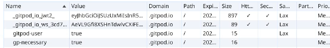
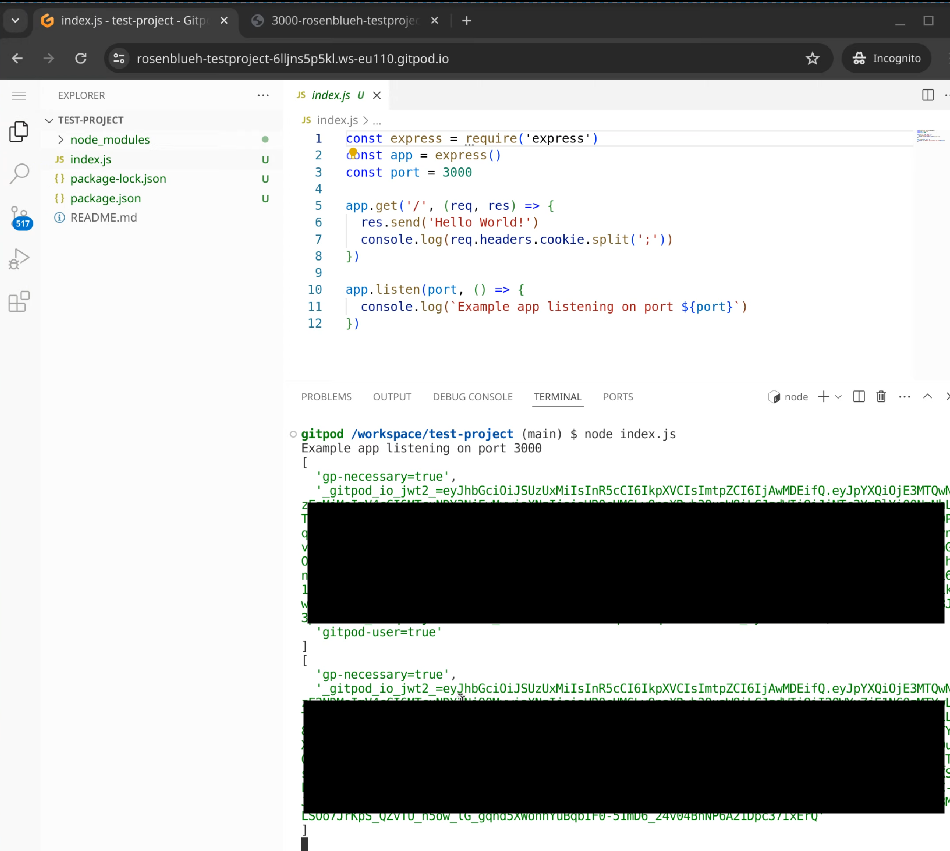

## Session hijacking via cookies scoped on parent domain

Gitpod offers their users to develop their own apps in a workspace under a subdomain of gitpod.io. The cookie `_gitpod_io_jwt2_` of the main admistration interface is scoped to the domain .gitpod.io, so it is sent to all subdomains by the users browser.

So we can start an express server on port 3000 in the workspace that is then exposed via the domain
`3000-rosenblueh-testproject-6lljns5p5kl.ws-eu110.gitpod.io`

This then logs the cookies of a victim that gets redirected to this domain.

There actually was a filter implemented, but it seems that the name of the cookie changed, so the filter was not working as intended. The issue got fixed by Gitpod within less than 24 hours after reporting it, with the following commit:  
[https://github.com/gitpod-io/gitpod/commit/486dab1bbfebedf965db7d4d591436880d8eac0a](https://github.com/gitpod-io/gitpod/commit/486dab1bbfebedf965db7d4d591436880d8eac0a)

Similarly to the [CVE-2023-0957](https://snyk.io/blog/gitpod-remote-code-execution-vulnerability-websockets/) discovered by Snyk, the impact of this was CVSS High.